### Chapter 2 Programming Fundamentals

This chapter describes the three general types of computer instructions and the way in which they are used in computer
programs. The first type of instruction is distinguished by the fact that it operates upon data that is stored in some
memory location and must tell the computer where the data is located in core so that the computer can find it.
This type of instruction is said to reference a location in core memory; therefore, these instructions are often
called memory reference instructions (MRI).

When speaking of memory locations, it is very important that a clear distinction is made between the address of
a location and the contents of that location. A memory reference instruction refers to a location by a 12-bit address;
however, the instruction causes the computer to take some specified action with the content of the location.
Thus, although the address of a specific location in memory remains the same, the content of the location is subject
to change. In summary, a memory reference instruction uses a 12-bit address value to refer to a memory location,
and it operates on the 12-bit binary number stored in the referenced memory location.

The second type of instructions are the operate microinstructions, which perform a variety of program operations
without any need for reference to a memory location. Instructions of this type are used to perform the following
operations: clear the accumulator, test for negative accumulator, halt program execution, etc.
Many of these operate microinstructions can be combined (microprogrammed)
to increase the operating efficiency of the computer.

The third general type of instructions are the input/output transfer (IOT) instructions.
These instructions perform the transfer of information between a peripheral device and
the computer memory. IOT instructions are discussed in Chapter 5.

#### PROGRAM CODING

Binary numbers are the only language which the computer is able to understand.
It stores numbers in binary and does all its arithmetic operations in binary.
What is more important to the programmer, however, is that in order for the computer to
understand an instruction it must be represented in binary.
The computer can not understand instructions which use English language words.
All instructions must be in the form of binary numbers (binary code).

**Binary Coding**

The computer has a set of instructions in binary code which it "understands".
In other words, the circuitry of the machine is wired to react to these
binary numbers in a certain manner.
These instructions have the same appearance as any other binary number;
the computer can interpret the same binary configuration of O's and 1's as 
data or as an instruction.
The programmer tells the computer whether to interpret the
binary configuration as an instruction or as data by the way
in which the configuration is encountered in the program.

Suppose the computer has the following binary instruction set.

    Instruction A   001 000 010 010     This binary number instructs the computer
                                        to add the contents of location 000 000 010 010
                                        to the accumulator.
                                        
                                        
    Instruction B   001 000 010 111     This binary number instructs the computer 
                                        to add the contents of location 000 000 010 111
                                        to the accumulator.

If instruction B is contained in a core memory location with an address
of 000 000 010 010 and the binary number 000 111 111 111 is stored in a
location with an address of 000 000 010 111, the following program could be
written: 

    Location            Content 
    000 000 010 010     001 000 010 111
    000 000 010 111     000 111 111 111
    
If this program were to be executed, the number 000 111 111 111 would be added to the accumulator.

**Octal Coding**

If binary configurations appear cumbersome and confusing,
the reader will now understand why most programmers seldom
use the binary number system in actual practice.
Instead, they substitute the octal number system which was discussed in
Chapter 1. The reader should not proceed until he understands these two number systems and the conversions between them.

Henceforth, octal numbers will be used to represent the binary numbers
which the computer uses. Although the programmer may use octal numbers to
describe the binary numbers within the computer, it should be remembered
that the octal representation itself does not exist within the computer.

*Note: Since this flavour of markdown does not support subscripts I
am using the Pythoin notation 0oxxxx to represent the octal number xxxx.*

When the conversion to octal is performed, Instruction B becomes 1027,
and the previous program becomes:

    Location            Content
    0o0022              0o1027
    0o0027              0o0777
    
To demonstrate that a computer cannot distinguish between a number and
an instruction, consider the following program.

    Location        Content
    0021            1022        (Instruction A)
    0022            1027        (Instruction B)
     .
     .
     .
    0027            0777        (The number 0o777)
    
Instruction A, which adds the contents of location 0022 to the accumulator,
has been combined with the previous program. Upon execution of the program
(assuming the initial accumulator value=0), the computer will execute
instruction A and add 1027 as a number to the accumulator obtaining a
result of 0o1027. The computer will then execute the next instruction,
which is 0o1027. causing the computer to add the contents of 0027 to
the accumulator. After the execution of the two instructions the number
0o2026 is in the accumulator. Thus, the above program caused the number
0o1027, to be used as an instruction and as a number by the computer.

**Mnemonic Coding**

Coding a program in octal numbers, although an improvement upon binary
coding, is nevertheless very inconvenient. The programmer must learn a
complete set of octal numbers which have no logical connection with the
operations they represent. The coding is difficult for the programmer
when he is writing the program, and this difficulty is compounded when
he is trying to debug or correct a program.
There is no easy way to remember the correspondence between an octal number
and a computer operation.

To simplify the process of writing or reading a program, each instruction
is often represented by a simple 3- or 4-letter mnemonic symbol.
These mnemonic symbols are considerably easier to relate to a computer
operation because the letters often suggest the definition of the
instruction. The programmer is now able to write a program in a language of letters and numbers which suggests the meaning of each instruction.

The computer still does not understand any language except binary
numbers. Now, however, a program can be written in a symbolic language
and translated into the binary code of the computer because of the
one-to-one correspondence between the binary instructions and the mnemonics.
This translation could be done by hand, defeating the purpose of mnemonic
instructions, or the computer could be used to do the translating for the
programmer. Using a binary code to represent alphabetic characters as
described in Chapter 1, the programmer is able to store alphabetic
information in the computer memory. By instructing the computer to perform
a translation, substituting binary numbers for the alphabetic characters,
a program is generated in the binary code of the computer.
This process of translation is called "assembling" a program.
The program that performs the translation is called an assembler.

Although the assembler is described in detail in Chapter 6,

it is well to make some observations about the assembler at this point.
1. The assembler itself must be written in binary code, not
mnemonics.
1. It performs a one-to-one translation of mnemonic codes into
binary numbers.
1. It allows programs to be written in a symbolic language which
is easier for the programmer to understand and remember.

A specific mnemonic language for the PDP-8, called PAL
(Program Assembly Language), is introduced later in this chapter.
The next section describes the general PDP-8 characteristics and components.
This information is necessary to an understanding of the PDP-8 instructions
and their uses within a program.

#### PDP-8 ORGANIZATION AND STRUCTURE

The PDP-8 is a high-speed, general purpose digital computer which operates
on 12-bit binary numbers. It is a single-address parallel machine using
two's complement arithmetic. It is composed of the five basic computer
units which were discussed in Chapter 1. The components of the five units
and their interrelationships are shown in Figure 2-1. For simplicity,
the input and output units have been combined.

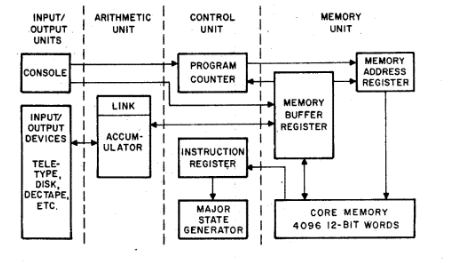

**Input and Output Units**

The input and output units are combined in Figure 2-1 because in many cases
the same device acts as both an input and an output unit.
The Teletype console, for example, can be used to input information
which will be accepted by the computer, or it can accept processed
information and print it as output.
Thus, the two units of input and output are very often joined and referred
to as input/output or simply 1/0. Chapter 5 describes the methods of
transmitting data as either input or output; but for the present,
the reader can assume that the computer is able to accept information
from devices such as those listed in the block diagram and to return output
information to the devices. The PDP-8 console allows the programmer direct
access to core memory and the program counter by setting a series of switches,
 as described in detail in Chapter 4.
 
**Arithmetic Unit**

The second unit contained in the PDP-8 block diagram is the arithmetic unit.
This unit, as shown in the diagram, accepts data from input devices and
transmits processed data to the output devices as well.
Primarily, however, the unit performs calculations under the direction of
the control unit. The Arithmetic Unit in the PDP-8 consists of an
accumulator and a link bit.

**ACCUMULATOR (AC)**

The prime component of the arithmetic unit is a 12-bit register called the
accumulator. It is surrounded by the electronic circuits which perform the
binary operations under the direction of the control unit.
Its name comes from the fact that it accumulates partial sums during the
execution of a program. Because the accumulator is only twelve bits in
length, whenever a binary addition causes a carry out of the most
significant bit, the carry is lost from the accumulator.
This carry is recorded by the link bit.

**LINK (L)**

Attached logically to the accumulator is a 1-bit register, called the link,
which is complemented by any carry out of the accumulator.
In other words, if a carry results from an addition of the most significant
bit in the accumulator, this carry results in a link value change from
0 to 1, or 1 to 0, depending upon the original state of the link.

Below is a diagram of the accumulator and link. The twelve bits of the
accumulator are numbered 0 to 11, with bit 0 being the most significant bit.
The bits of the AC and L can be either binary O's or 1's as shown below.

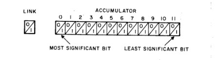

**Control Unit**

The instruction register, major state generator, and program counter can
be identified as part of the control unit. These registers keep track of
what the computer is now doing and what it will do next, thus specifying
the flow of the program from beginning to end.

**PROGRAM COUNTER (PC)**

The program counter is used by the PDP-8 control unit to record the
locations in memory (addresses) of the instructions to be executed.
The PC always contains the address of the next instruction to be executed.
Ordinarily, instructions are stored in numerically consecutive locations
and the program counter is set to the address of the next instruction
to be executed merely by increasing itself by 1 with each successive
instruction.
When an instruction causing transfer of command to another portion of the
stored program is encountered, the PC is set to the appropriate address.
The PC must be initially set by input to specify the starting address of a program,
but further actions are controlled by program instructions.

**INSTRUCTION REGISTER (IR)**

The 3-bit instruction register is used by the control unit to specify the main
characteristics of the instruction being executed. The three most significant
bits of the current instruction are loaded into the IR each time an instruction
is loaded into the memory buffer register from core memory. These three bits 
contain the operation code which specifies the main characteristics of an instruction.
The other details are specified by the remaining nine bits (called the operand) of
the instruction. 

**MAJOR STATE GENERATOR**

The major state generator establishes the proper states in sequence for the
instruction being executed. One or more of the following three major states are
entered serially to execute each programmed instruction. During a *Fetch* state,
an instruction is loaded from core memory, at the address specified by the
program counter, into the memory buffer register.
The *Defer* state is used in conjunction with indirect addressing to obtain the
effective address, as discussed under "Indirect Addressing" later in this chapter.
During the *Execute* state, the instruction in the memory buffer register is performed. 

**Memory Unit**

The PDP-8 basic memory unit consists of 4,096 12-bit words of *magnetic core memory*,
a 12-bit *memory address register*, and a 12-bit *memory buffer register*.
The memory unit may be expanded in units of 4,096 words up to a maximum of 32,768 words:

**CORE MEMORY**

The core memory provides storage for the instructions to be performed and information
to be processed. It is a form of random access storage, meaning that any specific
location can be reached in memory as readily as any other.
The basic PDP-8 memory contains 4,096 12-bit magnetic core words.
These 4,096 words require that 12-bit addresses be used to specify the address for
each location uniquely.

**MEMORY BUFFER REGISTER (MB)**

All transfers of instructions or information between core memory and the processor registers
(AC, PC, and IR) are temporarily held in the memory buffer register.
Thus, the MB holds all words that go into and out of memory, updates the program counter,
sets the instruction register, sets the memory address register, and accepts information
from or provides information to the accumulator.

**MEMORY ADDRESS REGISTER (MA)**

The address specified by a memory reference instruction is held in the memory address register.
It is also used to specify the address of the next instruction to be brought out of memory
and performed. It can be used to directly address all of core memory. The MA can be set by
the memory buffer register, or by input through the program counter register,
or by the program counter itself.

**MEMORY REFERENCE INSTRUCTIONS**

The standard set of instructions for the PDP-8 includes eight basic instructions.
The first six of these instructions are introduced in the following paragraphs and
are presented in both octal and mnemonic form with a description of the action of each instruction.

The memory reference instructions (MRI) require an operand to specify the address of the location
to which the instruction refers. The manner in which locations are specified for the PDP-8 is
discussed in detail under "Page Addressing" later in this chapter.
In the following discussion, the first three bits (the first octal digit) of an MRI are used to
specify the instruction to be performed.
(The last nine bits, three octal digits, of the 12-bit word are used to specify the address
of the referenced location--that is, the operand.)
The six memory reference instructions are listed below with their mnemonic and octal equivalents
as well as their memory cycle times.

                                                        Octal   Memory
    Instruction                         Mnemonic(2)     Value   Cycles(1)
    Logical AND                         AND             Onnn    2
    Two's Complement Add                TAD             1nnn    2
    Deposit and Clear the Accumulator   DCA             3nnn    2
    Jump                                JMP             5nnn    1
    Increment and Skip if Zero          ISZ             2nnn    2
    Jump to Subroutine                  JMS             4րոո    2

1. Memory cycle time for the PDP-8 and -8/I is 1.5 microseconds; for the PDP8/L, it is 1.6;
for the PDP-8/S, it is 8 microseconds. (Indirect addressing requires an additional memory cycle.)

1. The mnemonic code is meaningful to and translated by an assembler into
binary code.

**AND (Onnn.)**

The AND instruction causes a bit-by-bit Boolean AND operation between the contents
of the accumulator and the data word specified by the instruction.
The result is left in the accumulator as illustrated below.

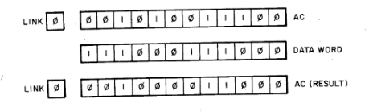

The following points should be noted with respect to the AND instruction:

1. A 1 appears in the AC only when a 1 is present in both the AC
and the data word (The data word is often referred to as a
mask);
1. The state of the link bit is not affected by the AND instruction;
and
1. The data word in the referenced location is not altered.

**TAD (1nnn)**

The TAD instruction performs a binary addition between the specified data word
and the contents of the accumulator, leaving the result of the addition in the
accumulator.
If a carry out of the most significant bit of the accumulator should occur,
the state of the link bit is complemented.
The add instruction is called a Two's Complement Add to remind the programmer
that negative numbers must be expressed as the two's complement of the positive value.
The following figure illustrates the operation of the TAD instruction.

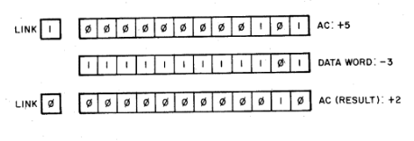

The following points should be remembered when using the TAD instruction:

1. Negative numbers must be expressed as a two's complement of
the positive value of the number;
2. A carry out of the accumulator will complement the link; and
3. The data word in the referenced location is not affected.

**DCA (3nnn)**

The DCA instruction stores the contents of the AC in the referenced location,
destroying the original contents of the location.
The AC is then set to all zeroes.
The following example shows the contents of the accumulator, link, and
location 225 before and after executing the instruction DCA 225.

    DCA 225
                        AC      Link    Loc. 225    
    Before Execution    1234    1       7654
    After Execution     0000    1       1234
    
The following facts should be kept in mind when using the DCA instruction:
1. The state of the link bit is not altered;
2. The AC is cleared; and
3. The original contents of the addressed location are replaced by
the value of the AC.

**JMP (5nnn)**

The JMP instruction loads the effective address of the instruction into the
program counter, thereby changing the program sequence since the PC specifies
the next instruction to be performed.
In the following example, execution of the instruction in location 250 (JMP 300)
causes the program to jump over the instructions in locations 251 through 277
and immediately transfer control to the instruction in location 300.

    Location    Content
    250         JMP 300 (This instruction transfers program control to location 300.)
     .              .
     .              .
     .              .
    300         DCA 330

NOTE: The JMP instruction does not affect the contents of
the AC or link. 

**ISZ (2nnn)**

The ISZ instruction adds a 1 to the referenced data word and then examines the
result of the addition.
If a zero result occurs, the instruction following the ISZ is skipped.
If the result is not zero, the instruction following the ISZ is performed.
In either case, the result of the addition replaces the original data word in memory.
The example in Figure 2-2 illustrates one method of adding the contents of a given
location to the AC a specified number of times (multiplying) by using an
ISZ instruction to increment a tally.
The effect of this example is to multiply the contents of location 275 by 2.
(To add the contents of a given location to the AC twice, using the ISZ loop,
as shown below, requires more instructions than merely repeating the
TAD instruction. However, when adding the contents four or more times,
use of the ISZ loop requires fewer instructions.)
In the first pass of the example, execution of ISZ 250 increments the contents
of location 250 from 7776 to 7777 and then transfers control to the following
instruction (JMP 200).
In the second pass, execution of ISZ 250 increments the contents of location 250
from 7777 to 0000 and transfers control to the instruction in location 203,
skipping over location 202.

    CODING FOR ISZ LOOP
    Location        Content
    200             TAD 275
    201             ISZ 250 
    202             JMP 200
    203             DCA 276
     .                  .
     .                  .
     .                  .
    250             7776
      '                 .
      .                 .
      .                 .
     275            0100
     276            0000
     
     SEQUENCE OF EXECUTION FOR ISZ LOOP
                        Content After Instruction Execution
    Location Content    АС      250         275         276 
    FIRST PASS 
    200     TAD 275     0100    7776        0100        0000
    201     ISZ 250     0100    7777        0100        0000
    202     JMP 200     0100    7777        0100        0000
    SECOND PASS
    200     TAD 275     0200    7777        0100        0000
    201     ISZ 250     0200    0000        0100        0000 
    202     JMP 200 (Skipped during second pass)
    203     DCA 276     0000    0000        0100        0200

The following points should be kept in mind when using the ISZ instruction:

1. The contents of the AC and link are not disturbed;
2. The original word is replaced in main memory by the incre
mented value;
3. When using the ISZ for looping a specified number of times,
the tally must be set to the negative of the desired number; and
4. The ISZ performs the incrementation first and then checks for
a zero result.

**JMS (4nnn)**

A program written to perform a specific operation often includes sets of instructions
which perform intermediate tasks. These intermediate tasks may be finding a square root,
or typing a character on a keyboard. Such operations are often performed many times
in the running of one program and may be coded as subroutines.
To eliminate the need of writing the complete set of instructions each time
the operation must be performed, the JMS (jump to subroutine) instruction is used.
The JMS instruction stores a pointer address in the first location of the subroutine
and transfers control to the second location of the subroutine.
After the subroutine is executed, the pointer address identifies the next instruction
to be executed.
Thus, the programmer has at his disposal a simple means of exiting from the
normal flow of his program to perform an intermediate task and a means
of return to the correct location upon completion of the task.
(This return is accomplished using indirect addressing, which is discussed later
in this chapter.)
The following example illustrates the action of the JMS instruction.

    Location Content 
    PROGRAM
    200     JMS 350     (This instruction stores 0201 in location 350
                        and transfers program control to location 351.)
    201     DCA 270     (This instruction stores the contents of
                        the AC in location 270 upon return from the subroutine.)
     .          .
     .          .
     .          .
                       
    SUBROUTINE
    350     0000        (This location is assumed to have an initial value of 0000;
                        after JMS 350 is executed, it is 0201.)
    351 iii             (First instruction of subroutine)
     .          .
     .          .
     .          .
     
    375     JMP I 350   (Last instruction of subroutine)
    
The following should be kept in mind when using the JMS: 
1. The value of the PC (the address of the JMS instruction +1)
is always stored in the first location of the subroutine, replacing
the original contents;
2. Program control is always transferred to the location designated
by the operand +1 (second location of the subroutine);
3. The normal return from a subroutine is made by using an in
direct JMP to the first location of the subroutine (JMP I 350 in the above example);
(Indirect addressing, as discussed later in this chapter, effectively transfers
control to location 201.);
4. When the results of the subroutine processing are contained in
the AC and are to be used in the main program, they must be stored upon return
from the subroutine before further calculations are performed.
(In the above example, the results of the subroutine processing are stored in
location 270.)

**ADDRESSING**

When the memory reference instructions were introduced, it was stated
that nine bits are allocated to specify the operand (the address referenced
by the instruction).
The method used to reference a memory location using these nine bits will
now be discussed.

**PDP-8 Memory Pages**

As previously described, the format of an MRI is three bits (0.1. and 2)
for the operation code and the remaining nine bits the operand.
However, a full twelve bits are needed to uniquely address the 4,096
(10,000 octal) locations that are contained in the PDP-8 memory unit.
To make the best use of the available nine bits, the PDP-8 utilizes
a logical division of memory into blocks (pages) of 200(octal) locations each,
as shown in the following table.

    Page    Memory Locations    Page    Memory Locations
     0           0-177          20      4000-4177
     1         200-377          21      4200-4377
     2         400-577          22      4400-4577
     3         600-777          23      4600-4777
     4        1000-1177         24      5000-5177
     5        1200-1377         25      5200-5377
     6        1400-1577         26      5400-5577
     7        1600-1777         27      5600-5777
    10        2000-2177         30      6000-6177
    11        2200-2377         31      6200-6377
    12        2400-2577         32      6400-6577
    13        2600-2777         33      6600-6777
    14        3000-3177         34      7000-7177
    15        3200-3377         35      7200-7377
    16        3400-3577         36      7400-7577
    17        3600-3777         37      7600-7777

Since there are 200 locations on a page and seven bits can represent
2008 different numbers, seven bits (5 through 11 of the MRI) are
used to specify the page address.
Before discussing the use of the page addressing convention by an MRI,
it should be emphasized that memory does not contain any physical page separations.
The computer recognizes only absolute addresses and does not know what page it is on,
or when it enters a different page. But, as will be seen, page addressing allows
the programmer to reference all of the 4,09610 locations of memory using only
the nine available bits of an MRI. The format of an MRI is shown below.

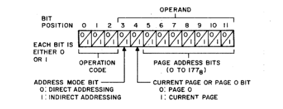

As previously stated, bits 0 through 2 are the operation code for the MRI.
Bits 5 through 11 identify a specific location on a given page,
but they do not identify the page itself.
The page is specified by bit 4, often called the *current page* or *page 0 bit*.
If bit 4 is a 0, the page address is interpreted as a location on page 0.
If bit 4 is a 1, the page address specified is interpreted to be on the current page
(the page on which the MRI itself is stored).
For example, if bits 5 through 11 represent 123 and bit 4 is a 0, the
location referenced is absolute address 123.
However, if bit 4 is a 1 and the current instruction is in a core memory location
whose absolute address is between 4,600s and 4,7778, the page address 123
designates the absolute address 4,7238.
Note that, as shown in the following example, this characteristic of page addressing
results in the octal coding for two TAD instructions on different memory pages being
identical when their operands reference the same relative location (page address)
on their respective pages.

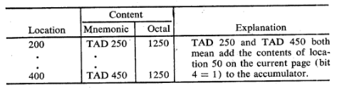

Except when it is on page 0, a memory reference instruction can reference 400 
locations directly, namely those 200 locations on the page containing the
instruction itself and the 200 locations on page 0, which can be addressed
from any memory location.

NOTE: If an MRI is stored in one of the first 200 memory locations (0 to
177), current page is page 0; therefore, only locations 0 to 177, are
directly addressable.

**Indirect Addressing**

In the preceding section, the method of directly addressing 400 memory locations
by an MRI was described_namely those on page 0 and those on the current page.
This section describes the method for addressing the other 7400g memory locations.
Bit 3 of an MRI, shown in the figure above but not discussed in the preceding section,
designates the address mode. When bit 3 is a 0, the operand is a direct address.
When bit 3 is a 1, the operand is an indirect address.
An indirect address (pointer address) identifies the location that contains the
desired address (effective address). To address a location that is not directly
addressable, the absolute address of the desired location is stored in one of
the 400s directly addressable locations (pointer address);
the pointer address is written as the operand of the MRI;
and the letter I is written between the mnemonic and the operand.
(During assembly, the presence of the I results in bit 3 of the MRI being set to 1.)
Upon execution, the MRI will operate on the contents of the location identified by
the address contained in the pointer location.
The two examples in Figure 2-4 illustrate the difference between direct addressing
and indirect addressing. The first example shows a TAD instruction that uses direct
addressing to get data stored on page 0 in location 50;
the second is a TAD instruction that uses indirect addressing,
with a pointer on page 0 in location 50, to obtain data stored in location 1275.
(When references are made to them from various pages, constants and pointer addresses
can be stored on page 0 to avoid the necessity of storing them on each applicable page.)
The octal value 1050, in the first example, represents direct addressing (bit 3 = 0);
the octal value 1450, in the second example, represents indirect addressing (bit 3 = 1).
Both examples assume that the accumulator has previously been cleared.

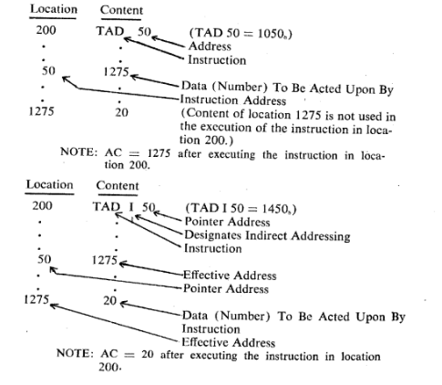

The following three examples illustrate some additional ways in which indirect
addressing can be used.
As shown in example 1, indirect addressing makes it possible to transfer program
control off page 0 (to any desired memory location).
(Similarly, indirect addressing makes it possible for other memory reference
instructions to address any of the 4,096 memory locations.)
Example 2 shows a DCA instruction that uses indirect addressing with a pointer on
the current page. The pointer in this case designates a location off the current page
(location 227) in which the data is to be stored.
(A pointer address is normally stored on the current page when all references to the
designated location are from the current page.)
Indirect addressing provides the means for returning to a main program from a subroutine,
as shown in example 3.
Indirect addressing is also effectively used in manipulating tables of data as
described and illustrated in conjunction with autoindexing in Chapter 3.

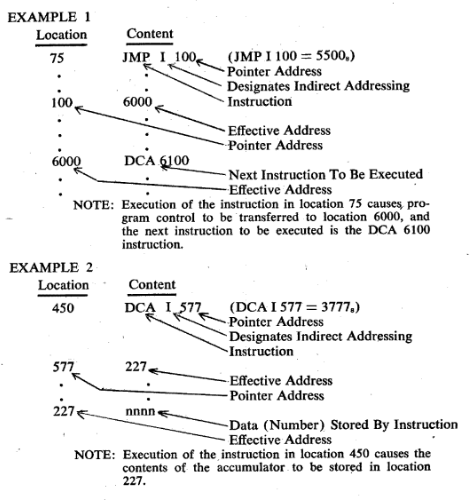

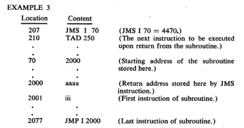

NOTES:
1. Execution of the instruction in location 207 causes the address 210 to be
stored in location 2000 and the instruction in location 2001 to be executed next.
Execution of the subroutine proceeds until the last instruction (JMP I 2000) causes
control to be transferred back to the main program, continuing with the execution
of the instruction stored in location 210.
2. A JMS instruction that uses indirect addressing is useful when the subroutine
is too large to store on the current page.
3. Storing the pointer address on page 0 enables instructions
on various pages to have access to the subroutine.

**OPERATE MICROINSTRUCTIONS**

The operate instructions (octal operation code = 7) allow the programmer to
manipulate and/or test the data that is located in the accumulator and link bit.
A large number of different instructions are possible with one operation code
because the operand bits are not needed to specify an address as they are in an MRI
and can be used to specify different instructions.
The operate instructions are separated into two groups:
Group 1, which contains manipulation instructions, and Group 2,
which is primarily concerned with testing operations.
Group 1 instructions are discussed first.

**Group 1 Microinstructions**

The Group 1 microinstructions manipulate the contents of the accumulator and link.
These instructions are microprogrammable; that is, they can be combined to perform
specialized operations with other Group 1 instructions.
Microprogramming is discussed later in this chapter.

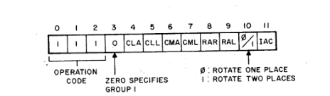

The preceding diagram illustrates the manner in which a PDP-8 instruction word is
interpreted when it is used to represent a Group 1 operate microinstruction.
As previously mentioned, 7, is the operation code for operate microinstructions;
therefore, bits 0 through 2 are all 1's.
Since a reference to core memory is not necessary for the operation of microinstructions,
bits 3 through 11 are not used to reference an address.
Bit 3 contains a 0 to signify that this is a Group 1 instruction,
and the remaining bits are used to specify the operations to be performed by the
instruction.
The operation of each individual instruction specified by these bits is described below.

    CLA     Clear the accumulator. If bit 4 is a 1, the instruction sets
            the accumulator to all zeroes.
    CLL     Clear the link. If bit 5 is a 1, the link bit is set to 0.
    СМА     Complement the accumulator. If bit 6 is a 1, the accumulator
            is set to the 1's complement of its original value;
            that is, all 1's become O's, and all O's become 1's.
    CML     Complement the link. If bit 7 is a 1, the state of the link bit
            is reversed.
    RAR     Rotate the accumulator and link right. If bit 8 is a 1 and bit 10 is a 0,
            the instruction treats the AC and L as a closed loop and shifts all bits
            in the loop one position to the right.
            This operation is illustrated by the following diagram.

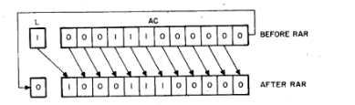

    RTR     Rotate the accumulator and link twice right. If bit 8 is a 1
            and bit 10 is also a 1, a shift of two places to the right
            is executed. Both the RAR and RTR instructions use what is commonly
            called a circular shift, meaning that any bit rotated off one end
            of the accumulator will reappear at the other end.
            This operation is illustrated below.
            
            
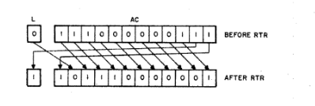

    RAL     Rotate the accumulator and link left. If bit 9 is a 1 and bit 10 is a 0,
            this instruction treats the AC and L as a closed loop and shifts all bits
            in the loop one position to the left, performing a circular shift to
            the left.
            
    RTL    Rotate the accumulator and link twice left. If bit 9 is a 1 and bit 10 is
            a 1 also, the instruction rotates each bit two positions to the left.
            (The RAL and RTL microinstructions shift the bits in the reverse direction
            of that directed by the RAR and RTR microinstructions.)
    
    IAC     Increment the accumulator. When bit 11 is a 1, the contents of the AC is
            increased by 1. NOP No operation. If bits 0 through 2 contain operation
            code 7, and the remaining bits contain zeros, no operation is performed
            and program control is transferred to the next instruction in sequence.
            
A summary of Group 1 instructions, including their octal forms, is given below.

    Mnemonic(1) Octal(2)    Operation                               Sequence
    NOP         7000        No operation                            -
    CLA         7200        Clear AC                                1
    CLL         7100        Clear link bit                          1
    СМА         7040        Complement AC                           2
    CML         7020        Complement link bit                     2
    RAR         7010        Rotate AC and L right one position      4
    RAL         7004        Rotate AC and L left one position       4
    RTR         7012        Rotate AC and L right two positions     4
    RTL         7006        Rotate AC and L left two positions      4
    IAC         7001        Increment AC                            3

1. Mnemonic code is meaningful to and translated by an assembler into binary
code.
2. Octal numbers conveniently represent binary instructions.
3. Sequence numbers indicate the order in which the operations are performed
by the PDP-8/I and PDP-8/L (sequence 1 operations are performed first, sequence
2 operations are performed next, etc.).

**Group 2 Microinstructions**

Group 2 operate microinstructions are often referred to as the "skip microinstructions"
because they enable the programmer to perform tests on the accumulator and link
and to skip the next instruction depending upon the results of the test.
They are usually followed in a program by a JMP (or possibly a JMS) instruction.
A skip instruction causes the computer to check for a specific condition, and,
if it is present, to skip the next instruction. If the condition were not present,
the next instruction would be executed.

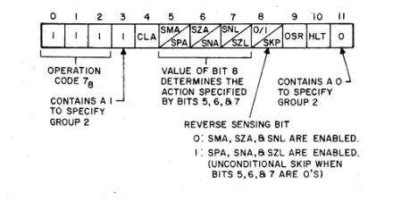

The available instructions are selected by bit assignment as shown in the above diagram.
The operation of each individual instruction specified by these bits is described below.

    CLA     Clear the accumulator. If bit 4 is a 1, the instruction sets the accumulator
            to all zeros.
            
    SMA     Skip on minus accumulator. If bit 5 is a 1 and bit 8 is a v.
            the next instruction is skipped if the accumulator is less than zero.
            
    SPA     Skip on positive accumulator. If bit 5 is a 1 and bit 8 is a 1,
            the next instruction is skipped if the accumulator is greater than or
            equal to zero
            .        
    SZA     Skip on nonzero accumulator. If bit 6 is a 1 and bit 8 is a 1,
            the next instruction is skipped if the accumulator is not zero.
            
    SNA     Skip on nonzero accumulator. If bit 6 is a 1 and bit 8 is a 1 also,
            the next instruction is skipped if the accumulator is not zero.
         
    SNL     Skip on nonzero link. If bit 7 is a 1 and bit 8 is a 0,
            the next instruction is skipped when the link bit is a 1.
            
    SZL     Skip on zero link. If bit 7 is a 1 and bit 8 is a 1,
            the next instruction is skipped when the link bit is a 0.
            
    SKP     Unconditional skip. If bit 8 is a 1 and bit 5, 6 and 7 are all zeros,
            the next instruction is skipped.
            (Bit 8 is a reverse sensing bit when bits 5, 6 or 7 are used
            -- see SMA, SPA, SZA, SNA, SNL, and SZL above.)
            
    OSR     Inclusive OR of switch register with AC. If bit 9 is a 1,
            an inclusive OR operation is performed between the content of
            the accumulator and the console switch register.
            The result is left in the accumulator and the original content
            of the accumulator is destroyed.
            In short, the inclusive OR operation consists of the comparison of
            the corresponding bit positions of the two numbers and the insertion of
            a 1 in the result if a l appears in the corresponding bit position in
            either number. See Chapter 1 for further discussion.
            The action of the instruction is illustrated below.
            
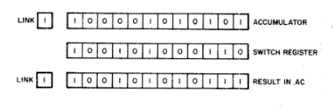

    HLT     Halt. If bit 10 is a 1, the computer will stop at the conclusion
            of the current machine cycle.

A summary of Group 2 instructions, including their octal representation,
is given in the following table.

    Mnemonic    Octal   Operation                           Sequence
    CLA         7600    Clear the accumulator               2
    SMA         7500    Skip on minus accumulator           1
    SPA         7510    Skip on positive accumulator        1
                        (or AC = 0)                         1
    SZA         7440    Skip on zero accumulator            1
    SNA         7450    Skip on nonzero accumulator         1
    SNL         7420    Skip on nonzero link                1
    SZL         7430    Skip on zero link                   1
    SKP         7410    Skip unconditionally                1
    OSR         7404    Inclusive OR, switch register       3
                        with AC
    HLT         7402    Halts the program                   3

**MICROPROGRAMMING**

Because PDP-8 instructions of Group 1 and Group 2 are determined
by bit assignment, these instructions may be combined, or microprogrammed,
to form new instructions enabling the computer to do more operations in less time.

**Combining Microinstructions**

The programmer should make certain that the program clears the accumulator and
link before any arithmetic operations are performed.
To perform this task, the program might include the following instructions
(given in both octal and mnemonic form).

    CLA             7200 (octal)
    CLL             7100 (octal)
    
However, when the Group 1 instruction format is analyzed, the following is observed.

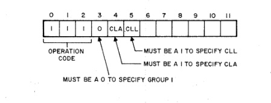

Since the CLA and the CLL instructions occupy separate bit positions,
they may be expressed *in the same instruction*, thus combining the two operations
into one instruction. This instruction would be written as follows.

    CLA             CLL 7300 (octal)

In this manner, many operate microinstructions can be combined making the execution
of the program much more efficient. The assembler for the PDP-8 will combine the
instructions properly when they are written as above, that is, on the same coding line,
and separated by a space.

**Illegal Combinations**
 
Microprogramming, although very efficient, can also be troublesome for the new
programmer. There are many violations of coding which the assembler will not accept.

One rule to remember is: "If you can't code it, the computer can't do it."
In other words, the programmer could write a string of mnemonic microinstructions,
but unless these microinstructions can be coded correctly in octal representation,
they cannot be performed. To illustrate this fact, suppose the programmer would
like to complement the accumulator (CMA), complement the link (CML), and then skip
on a nonzero link (SNL). He could write the following.

                CMA CML SNL

These instructions require the following bit assignments.

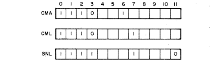

The three microinstructions cannot be combined in one instruction because bit 3 is
required to be a 0 and a 1 simultaneously. Therefore, no instructions may be used
which combine Group 1 and Group 2 microinstructions because bit 3 usage is not
compatible. The CMA and CML can, however, be combined because their bit assignments
are compatible. The combination would be as follows.

                CMA CML 7060 (octal)
                
To perform the original set of three operations, two instructions are needed.

                CMA CML 7060 (octal)
                SNL 7420 (octal)

Because Group 1 and Group 2 microinstructions cannot be combined, the commonly
used microinstruction CLA is a member of both groups. Clearing the AC is often
required in a program and it is very convenient to be able to microprogram the
CLA with the members of both groups.

The problem of bit assignment also arises when some instructions within a group
are combined. For example, in Group 1 the rotate instructions specify the number
of places to be rotated by the state of bit 10. If bit 10 is a 0, rotate one place;
if bit 10 is a 1, rotate two places. Thus, the instruction RAL can not be combined
with RTL because bit 10 would be required to have two different values at once.
If the programmer wishes to rotate right three places, he must use two separate
instructions.

                RAR         7010 (octal)
                RTR         7012 (octal)
                
Although he can write the instruction "RAR RTR", it cannot be correctly converted to
octal by the assembler because of the conflict in bit 10; therefore, it is illegal.

**Combining Skip Microinstructions**

Group 2 operate microinstructions use bit 8 to determine the instruction specified by
bits 5, 6, and 7 as previously described. If bit 8 is a 0, the instructions SMA, SZA,
and SNL are specified. If bit 8 is a 1, the instructions SPA, SNA, and SZL are specified.
Thus, SMA cannot be combined with SZL because of the opposite values of bit 8.
The skip condition for combined microinstructions is established by the skip conditions
of the individual mcroinstructions in accordance with the rules for logic operations
(see "Logic Primer" in Chapter 1).

*OR* GROUP_SMA OR SZA OR SNL

If bit 8 is a 0, the instruction skips on the logical OR of the conditions specified
by the separate microinstructions. The next instruction is skipped if any of the
stated conditions exist.
For example, the combined microinstruction SMA SNL will skip under the
following conditions:

1. The accumulator is negative, the link is zero.
2. The link is nonzero, the accumulator is not negative.
3. The accumulator is negative and the link is nonzero.

(It will not skip if all conditions fail.)
This manner of combining the test conditions is described as the logical OR of the
conditions.

*AND* GROUP_SPA AND SNA AND SZL

A value of bit 8 = 1 specifies the group of microinstructions SPA, SNA, and SZL
which combine to form instructions which act according to the logical AND of the
conditions. In other words, the next instruction is skipped only if all conditions
are satisfied. For example, the instruction SPA SZL will cause a skip of the next
instruction only if the accumulator is positive and the link is zero.
(It will not skip if either of the conditions fail.)

NOTES:
1. The programmer is not able to specify the manner
of combination. The SMA, SZA, SNL conditions are always combined by the logical OR,
and the SPA, SNA, SZL conditions are always joined by a
logical AND.
2. Since the SPA microinstruction will skip on either
a positive or a zero accumulator, to skip on a strictly positive (positive, nonzero) accumulator the combined microinstruction SPA SNA is used.

**Order of Execution of Combined Microinstructions**

The combined microinstructions are performed by the computer in a very definite
sequence. When written separately, the order of execution of the instructions is
the order in which they are encountered in the program.
In writing a combined instruction of Group 1 or Group 2 microinstructions,
the order written has no bearing upon the order of execution.
This should be clear, because the combined instruction is a 12-bit binary number
with certain bits set to a value of 1. The order in which the bits are set to 1
has no bearing on the final execution of the whole binary word.

The definite sequence, however, varies between members of the PDP-8 computer family.
The sequence given here applies to the PDP8/I and PDP-8/L.
The applicable information for other members of the PDP-8 family is given in Appendix E. The order of execution for PDP-8/I and PDP-8/L microinstructions is as follows.

    GROUP 1
    Event 1     CLA, CLL - Clear the accumulator and/or clear the link are the first
                actions performed. They are effectively performed simultaneously
                and yet independently.
                
    Event 2     CMA, CML - Complement the accumulator and/or complement the link.
                These operations are also effectively performed simultaneously,
                and independently.
                
    Event 3     IAC - Increment the accumulator. This operation is performed third
                allowing a number in the AC to be complemented and then incremented
                by 1, thereby forming the two's complement, or negative, of the
                number.
                
    Event 4     RAR, RAL, RTR, RTL-The rotate instructions are performed last in
                sequence. Because of the bit assignment previously discussed,
                only one of the four operations may be performed in each combined
                instruction.

    GROUP 2
    Event 1     Either SMA or SZA or SNL when bit 8 is a 0.
                Both SPA and SNA and SZL when bit 8 is a 1.
                Combined microinstructions specifying a skip are performed first.
                The microinstructions are combined to form one specific test,
                therefore, skip instructions are effectively performed simultaneously.
                Because of bit 8, only members of one skip group may be combined
                in an instruction.

    Event 2     CLA - Clear the accumulator. This instruction is performed second
                in sequence thus allowing different arithmetic operations to be
                performed after testing (see Event 1) without the necessity of
                clearing the accumulator with a separate instruction before some
                subsequent arithmetic operation.
                
    Event 3     OSR-Inclusive OR between the switch register and the AC.
                This instruction is performed third in sequence, allowing the AC
                to be cleared first, and then loaded from the switch register.
                
     Event 4    HLT - The HLT is performed last to allow any other operations to be
                concluded before the program stops.
                
This is the order in which all combined instructions are performed. In order to
perform operations in a different order, the instructions must be written separately
as shown in the following example. One might think that the following combined
microinstruction would clear the accumulator, perform an inclusive OR between the
SR and the AC, and then skip on a nonzero accumulator.

                CLA OSR SNA

However, the instruction would not perform in that proper manner, because the
SNA would be executed first. In order to perform the skip last,
the instructions must be separated as follows.

                CLA OSR
                SNA
                
Microprogramming requires that the programmer carefully code mnemonics legally so
that the instruction does in fact do what he desires it to do.
The sequence in which the operations are performed and the legality of
combinations is crucial to PDP-8 programming.
The following is a list of commonly used combined microinstructions, some of
which have been assigned a separate mnemonic.

    Instruction                 Explanation
    -       CLA CLL             Clear the accumulator and link.
    CIA     CMA TIAC            Complement and increment the accumulator.
                                (Sets the accumulator equal to its own negative.)
    LAS     CLA OSR             Load accumulator from switches.
                                (Loads the accumulator with the value of the
                                switch register.)
    STL     CLL CML             Set the link (to a 1).
    -       CLA IAC             Sets the accumulator to a 1.
    STA     CLA CMA             Sets the accumulator to a -1.

In summary, the basic rules for combining operate microinstructions are given below.

1. Group 1 and Group 2 microinstructions cannot be combined.
2. Rotate microinstructions (Group 1) cannot be combined with
each other.
3. OR Group (SMA, SZA, or SNL) microinstructions cannot be
combined with AND Group (SPA, SNA, or SZL) microin
structions.
4. OR Group microinstructions are combined as the logical OR
of their respective skip conditions. AND Group microinstructions are combined as the logical AND of their respective skip
conditions.
5. Order of execution for combined instructions (PDP-8/I and PDP-8/L only) is listed
below.

   Group 1                      Group 2
   
    1. CLA, CLL                 1. SMA/SZA/SNL or
                                SPA/SNA/SZL
    2. CMA, CML                 2. CLA
    3. IAC                      3. OSR
    4. RAR, RAL, RTR, RTL       4. HLT

 

